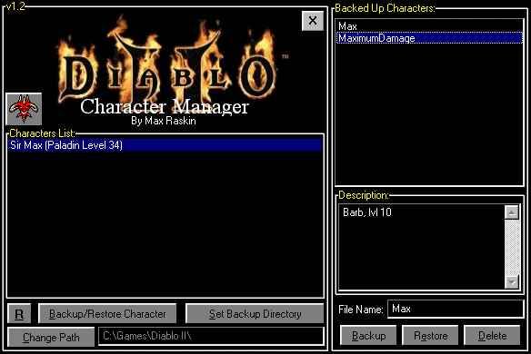



## Diablo II Character Manager \* Updated \*

### Description

Updated Again !

I know there are some backup utilities hanging around the web, but I wanted to make something of my own and also share the source code with other people, so anyway, in this character manager program, you can backup quickly and easily any character and also add a description of it so you will know what backup is that, it uses Info-Zip's zip compression for the making of the backup files, and stores the save and the description in the same file, all is quickly compressed and uncompressed.

It also has a character monitor (timer) that the program knows when any new character is created.

I have tested this program and it works 100% fine, and if something wrong u can easily modify the code and do things of your own ! :)

in the zip file you will find also the unzipping and zipping DLLs of Info-Zip,
 
### More Info
 

             |
---                |---
**Submitted On**   |2000-08-08 22:42:08
**By**             |[Max Raskin](https://github.com/Planet-Source-Code/PSCIndex/blob/master/ByAuthor/max-raskin.md)
**Level**          |Advanced
**User Rating**    |4.0 (8 globes from 2 users)
**Compatibility**  |VB 5\.0, VB 6\.0
**Category**       |[Complete Applications](https://github.com/Planet-Source-Code/PSCIndex/blob/master/ByCategory/complete-applications__1-27.md)
**World**          |[Visual Basic](https://github.com/Planet-Source-Code/PSCIndex/blob/master/ByWorld/visual-basic.md)
**Archive File**   |[CODE\_UPLOAD8755882000\.zip](https://github.com/Planet-Source-Code/max-raskin-diablo-ii-character-manager-updated__1-10288/archive/master.zip)

